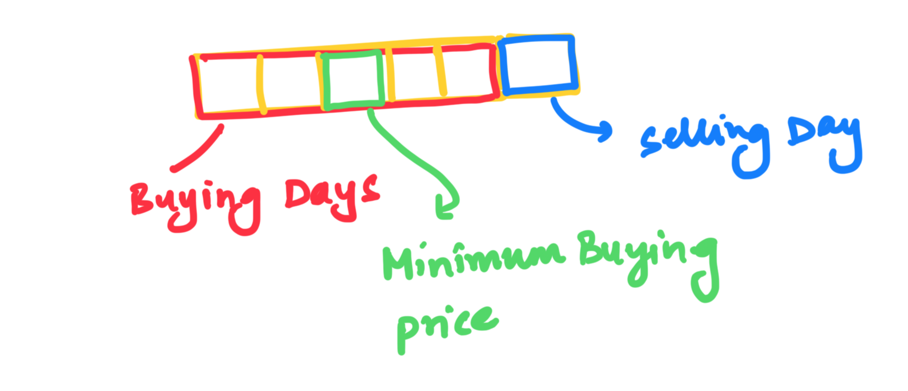

## Problem Statement

Given an array `prices` where `prices[i]` represents the price of a given stock on the i<sup>th</sup> day, return the maximum profit one can make by doing a single transaction. 

NOTE: If you cannot make any profit, return `0`.

---
## Basic Intuition

The problem involves exploring all pairs of prices  `(prices[i], prices[j]) where i<=j & prices[i] <= prices[j]` and keeping track of the maximum profit (`prices[j] - prices[i]`).

---
## Brute Force Approach - Nested Loop

Use a nested loop `[i, j]` to iterate over all valid pairs of prices and keep track of the maximum profit.

#### Algorithm

- let `maxProfit = 0`; 
- loop from `i = [0, n)` to iterate over all buying days:
	- loop from `j = [i, n)` to iterate over all selling days considering the stock is bought on the i<sup>th</sup> day:
		- `maxProfit = max(maxProfit, prices[j] - prices[i])`;
-  return `maxProfit`;

#### Time Complexity Analysis

We will explore all n<sup>2</sup> pairs. Thus, total time complexity is O(n<sup>2</sup>).

#### Space Complexity Analysis

No extra space has been used. Thus, total space complexity is O(1).

#### Code

```
public int maxProfit(int[] prices) {
	int n = prices.length;
	int maxProfit = 0;
	for(int i=0; i<n; i++) {
		for(int j=i; j<n; j++) {
			maxProfit = Math.max(maxProfit, prices[j]-prices[i]);
		}
	}
	return maxProfit;
}
```

---
## Redundant Operations

If we decided to sell at any `prices[j]`, there's no need to check all potential buy `prices[i] where 0 <= i<= j`. We can determine the maximum profit when selling at `prices[j]` by buying at the **lowest price observed** in the range `[0:j]`.



---
## Greedy Approach

Iterate over all **potential selling prices: `prices[j]`** and calculate the **maximum profit** one can achieve by selling at `prices[j]` and buying at the **minimum buying price** observed so far.

#### Algorithm

- let `maxProfit = 0`;
- let `minBuyPrice = Infinity`;
- loop from `j = [0, n)`:
	- `minBuyPrice = min(minBuyPrice, prices[j])`;
	- `maxProfit = max(maxProfit, prices[j] - minBuyPrice)`;
- return `maxProfit`;

#### Time Complexity Analysis

We will only iterate through the input array once. Thus, total time complexity is O(n). 

#### Space Complexity Analysis

No extra space has been used. Thus, total space complexity is O(1).

#### Code

```
public int maxProfit(int[] prices) {
	int n = prices.length;
	int maxProfit = 0;
	int minBuyPrice = Integere.MAX_VALUE;

	for(int j=0; j<n; j++) {
		minBuyPrice = Math.min(minBuyPrice, prices[j]);
		maxProfit = Math.max(maxProfit, prices[j] - minBuyPrice);
	}

	return maxProfit;
}
```


