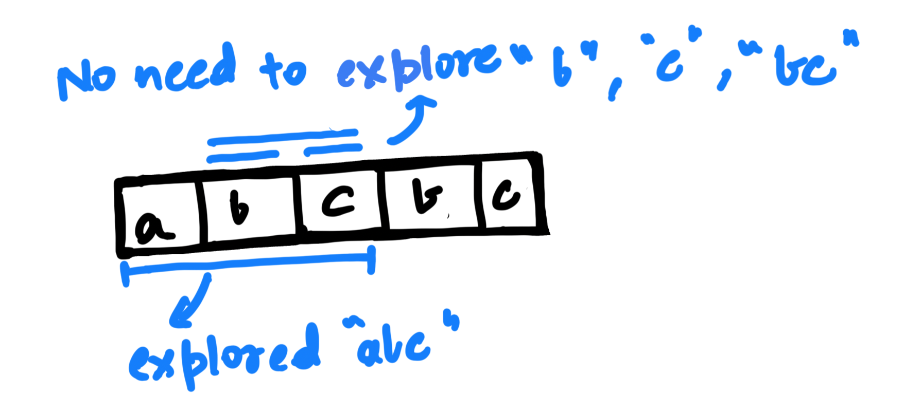
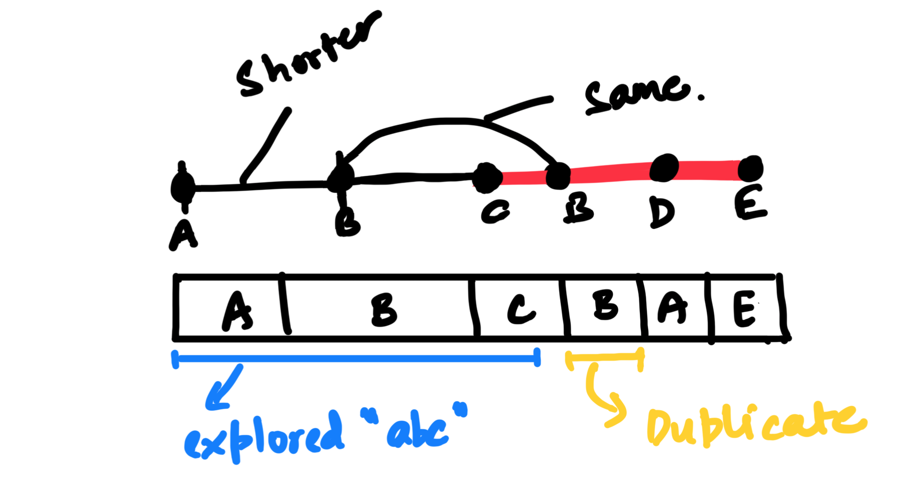

## Problem Statement

Given a string `s`, find the length of the longest substring without duplicate characters.

Example: For s = `abcbae`, the answer is `cbae`, with the length of 4.

## General Observations

- Explore all possible substrings and find the longest one which contains only unique  characters.

- **Brute Force Approach:** 
    
	- **Use a nested loop `[i, j]` to explore the longest possible substrings (containing unique characters) starting from each character `s[i]` and keep track of the longest one.**
    
	- **Algorithm:**
		1. **Initialise** `maxLength = 0` to store the longest substring length;
		2. **Loop** from `i = [0, n-1]` to iterate through each character `s[i]`:
			- **Initialise** `currLength = 0` to store the length of the longest substring starting at `s[i]`.
			- **Loop** from `j = [i, n-1]` to expand the substring starting from `s[j=i]` one character at a time:
				- **If** `s[j]` has already been seen, i.e., duplicate: break the `jth` inner loop;
				- **Otherwise**, increment `currLength` by 1;
			- **Update** `maxLength` if `currLength` is longer.
		3. **Return** `maxLength` after checking all possible substrings.  

	- **Time Complexity Analysis:**
		- Outer loop runs **n** times.
		- In worst-case scenario (all unique characters), the inner loop runs **n** times.
		- Adding elements to a hash set is constant time operation.
		- Thus, total time complexity is **O(n<sup>2</sup>)**. 

	- **Space Complexity Analysis:**
		- In worst-case scenario (all unique characters), the hash set will store **n** elements.
		- Thus, total space complexity is **O(n)**.


	```
	public int lengthOfLongestSubstring(String s) {
	
		// Step 1: Initialise maxLength to store the longest substring length
		int n = s.length();
		int maxLength = 0;
			
		// Step 2: Try every possible starting point
		for(int i=0; i<n; i++) {

			// Find the length of the longest substring starting from s[i]
			int currLength = 0;
			Set<Character> set = new HashSet<>();
				
			for(int j=i; j<n; j++) {
				// Stop if duplicate is found
				if(set.contains(s.charAt(j))) break;
				set.add(s.charAt(j));
				currLength++;	
			}

			// Update the maxLength
			maxLength = Math.max(maxLength, currLength);
			
		}

		// Step 3: Return the maxLength 
		return maxLength;
		
	}
	```

- **Redundant Operations:** 

	- If **substring** `s[i,j]` **represents the longest substring starting from** `s[i]` , then **any substring starting from a later index** `s[i+k, j] where i < k ≤ j` **will be shorter** and is therefore **redundant to explore separately**.

	

	- While exploring all substrings `s[i,j]` that contain unique characters starting from `s[i]`, if we encounter a duplicate character `s[l] = s[k]` (where `l = j + 1` and `i < k ≤ j`), instead of **restarting the search from `i+1`, we can shrink the window from left** by moving `i` to `k + 1` to eliminate the duplicate. 

	

- **Sliding Window - Two pointers Approach:**

	- Use **two pointers** (`left` and `right`) to define use the **current substring window** that **expands** when characters are unique and **shrinks** when duplicates are found.

	- **Algorithm:**
		1. Initialise `left = 0` and `right = 0` to define the current substring window;
		2. Expand the window until `right` reaches the end of the string:
		    - If `s[right]` is not in the window, add it and update `maxLength`.
		    - If `s[right]` is already in the window, shrink the window by moving `left` until the duplicate is removed.

	- **Time Complexity Analysis:**
		- In worst-case scenario (all duplicate character - `aaaa`), both the pointers will move **n times**.
		- Thus, total time complexity is **O(n)**.

	- **Space Complexity Analysis:**
		- In worst-case scenario (all unique characters), the hash set will store **n** elements.
		- Thus, total space complexity is **O(n)**.


	```
	public int lengthOfLongestSubstring(String s) {
	
		int n = s.length();
		int maxLength = 0;
		int left = 0;

		Map<Character, Integer> posMap = new HashMap<>();
		for(int right=0; right<n; right++) {
			char ch = s.charAt(right);
			if(posMap.containsKey(ch)) left = Math.max(left, posMap.get(ch) + 1);
			maxLength = Math.max(maxLength, right-left+1);
			posMap.put(ch, right);
		}

		return maxLength;
		
	}
	```
