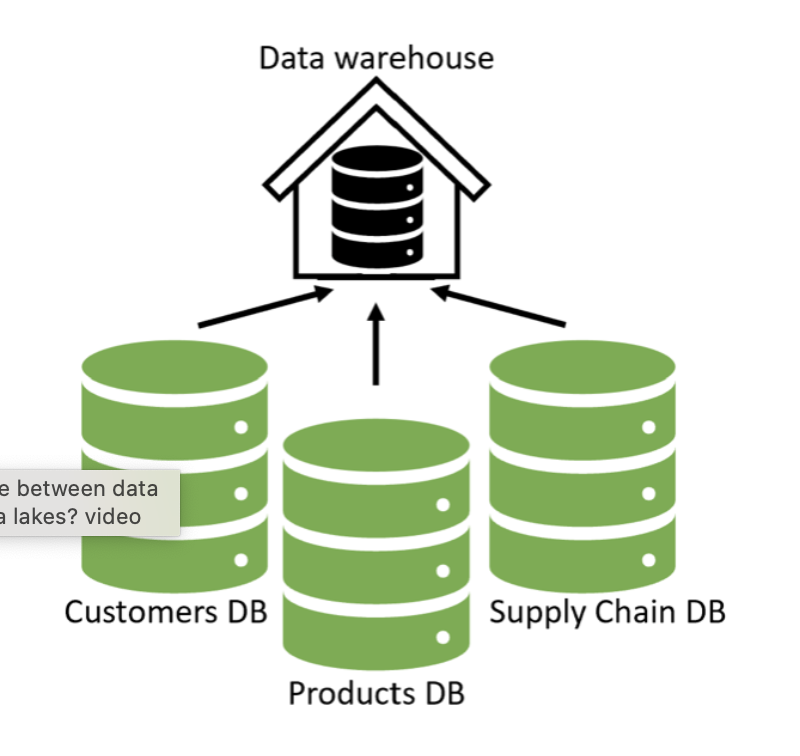

Data warehouses gather data from different areas of an organisation, integrate it, and make it available for analysis.

They are built as a central data store for the entire organisation, representing many departments. Therefore, there are many data sources as input to the data warehouse, including multiple databases or even non-databases such as a log file.

All this data is collected, transformed if needed, and integrated into a **structured format** into the data warehouse in an ETL process or extract, transform, and load. 

> **NOTE:** The data in the data warehouse is structured into tables with rows and columns. This structure can make it complex to change because of upstream and downstream effects. 

Data warehouses are large, typically larger than 100 GB. 

---

Q. Why not query the different transactional databases when performing an analysis versus using a data warehouse?

Running queries involving a large amount of data could take a very long time, possibly slowing down the database and restricting it from its primary purpose of recording transactions.

---
