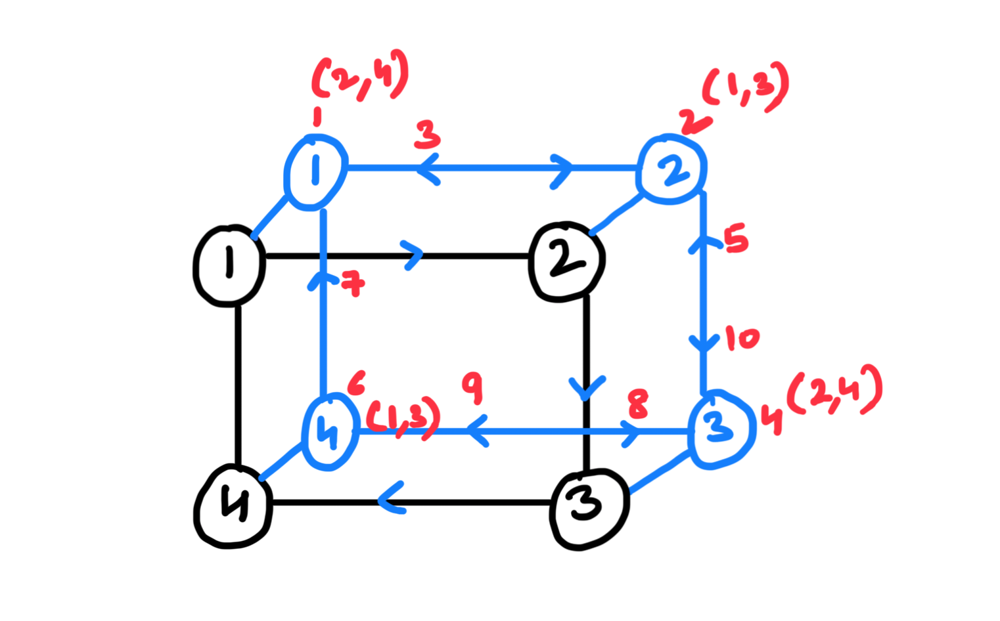

## Problem Statement

Given the reference of a node in a **connected undirected graph**, return a **deep copy** of the graph.

**NOTE:** Each node in the graph contains a value (`int`) and a list (`List[Node]`) of its neighbours.

```
Sample Graph: 

[
	1: [2,4],
	2: [1,3],
	3: [2,4], 
	4: [1,3]
]
```

## General Observations

The problem involves **traversing the original graph to discover its structure** and creating an identical copy while maintaining correct connections between nodes.

> **NOTE:** Before we create connections, we need to ensure that all neighbour nodes are created.

## Intuition

Use DFS traversal to explore the graph **deeply first**, cloning nodes as it encounters them, and then backtracks to connect them.

> NOTE: When a node is cloned, store it in a hash map (`original → clone`). This ensures that **whenever we encounter the same node again, we reuse its clone** instead of creating a new one.



## Algorithm - DFS (Recursive)

```
function F(node, map): // return a deep copy of node and all its neighbours

	// Base Condition:
	if map[node] exists: return map[node];

	// Recursive Steps:
	nodeClone = Node(node);
	map[node] = nodeClone;
	for each neighbour of node:
		neighbourClone = F(neighbour, map);
		nodeClone.neighbours.add(neighbourClone);
		
	return nodeClone;
```

## Time Complexity

- We are processing **each node (V) and edge (E) only once**. 
- Hence, time complexity = `O(V+E)`.

## Space Complexity

- The hash map will store `original → clone` mapping for all `V` vertices.
- The recursive stack will store at most `V` function calls simultaneously.
- Hence, space complexity = `O(V)`.

## Code

```
public Node deepCopy(Node node, Map<Node, Node> cloneMap) {

	// Base Condition:
	if(cloneMap.containsKey(node)) return cloneMap.get(node);

	// Recursive Steps:
	Node cloneNode = new Node(node.val);
	cloneMap.put(node, cloneNode);

	// Explore each neighbour
	for(Node neighbor: node.neighbors) {
		Node cloneNeighbor = deepCopy(neighbor, cloneMap);
		cloneNode.neighbors.add(cloneNeighbor);
	}

	return cloneNode;

}

public Node cloneGraph(Node node) {
	if(node == null) return null;
	Map<Node, Node> cloneMap = new HashMap<>();
	return deepCopy(node, cloneMap);
}
```


