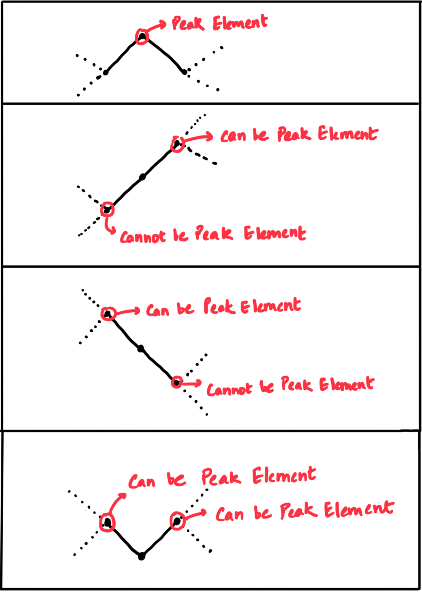

Given an integer array `nums`, return the index of any of the peak elements.

> **NOTE:** A peak element is an element that is strictly greater than its adjacent neighbours.

**Example:** `nums = [1,2,3,1]; Output = 2 (element = 3)`

---
### General Observations

- Can `nums` be empty?
- No.

- What should be the output of the following input: `nums = [1]`?
- Assuming `nums[-1] = nums[n] = -∞`, output = 0.

- What should be the output of the following input: `nums = [3,2,1]`?
- Assuming `nums[-1] = -∞`, output = 0.

- **What should be the output of the following input: `nums = [1,1,1,1]`?**
- **Invalid input**, two adjacent elements cannot be equal. Moreover, **it is guaranteed that at least one peak element exists**. 

- What should be the output of the following input: `nums = [1,2,1,3,5,6,4]`?
- The output can be either `index number = 1` where the `peak element = 2`, or `index number = 5` where the `peak element = 6`.

---
### Linear Search - Brute Force Approach

Iterate over the `nums` array and return the index of the first peak element observed.

**Algorithm:**

```
- if n == 1: return 0; // Base Condition

- if nums[0] > nums[1]: return 0; // Edge Case
- if nums[n-1] > nums[n-2]: return n-1; // Edge Case

- run loop for i in range: [1, n-2]:
	- if nums[i-1] < nums[i] > nums[i+1]: return i;
```

**Time Complexity:** `O(n)`.

**Space Complexity:** `O(1)`.

---
### Binary Search - Most Optimised Approach

<strong><span style="color: Purple">Trick:</span> <span style="color:red; ; background: Bisque">The peak element can only be found in the direction of increasing (rising) sequence.</span></strong>



**Algorithm:**
 
```
- if n == 1: base condition -> return 0; 

- if nums[0] > nums[1]: edge case -> return 0; 
- if nums[n-1] > nums[n-2]: edge case -> return n-1;

- left = 1, right = n-2;
- while left <= high, the binary search doesn't converges:

	- mid = (low + high) / 2; 

	- if nums[mid-1] < nums[mid] > nums[mid+1]:
		// nums[mid] is the peak element
		- return mid; 

	- if nums[mid-1] < nums[mid] < nums[mid+1]:
		// nums[mid] lies on the increasing slope
		- left = mid + 1; 

	- if nums[mid-1] > nums[mid] > nums[mid+1]:
		// nums[mid] lies on the decreasing slope
		- right = mid - 1;

	- if nums[mid-1] > nums[mid] < nums[mid+1]:
		// nums[mid] is a valley point, peak can exist on either side (IMP)
		- right = mid - 1;
```

**Time Complexity:** `O(logn)`.

**Space Complexity:** `O(1)`.

---


