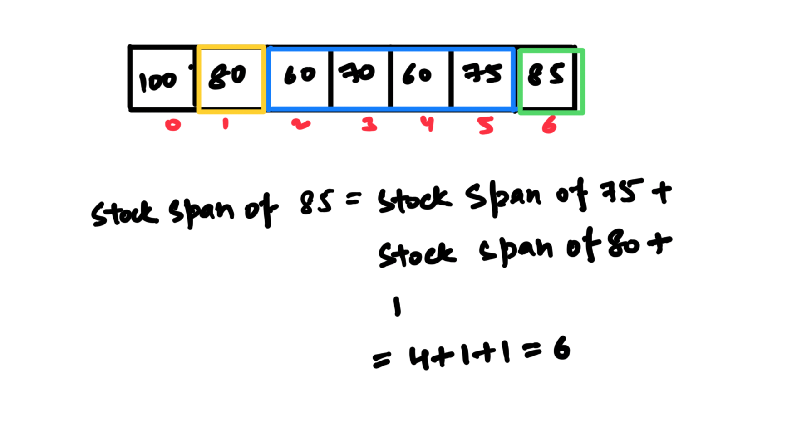

Link: [Leetcode 901](https://leetcode.com/problems/online-stock-span/description/)

---
### Problem Statement

**Design an algorithm** that **collects daily price quotes for some stock** and **returns the span** of that stock's price for the current day.

> The **span** of the stock's price in one day is the maximum number of consecutive days (starting from that day and going backward) for which the stock price was less than or equal to the price of that day.

<span style="color:green;">Implement the</span> `StockSpanner` <span style="color:green;">class:</span>

- `StockSpanner()` <span style="color:green;">Initializes the object of the class.</span>
- `int next(int price)` <span style="color:green;">Returns the <strong>span</strong> of the stock's price given that today's price is</span> `price`.

```
Example 1

Input:
	["StockSpanner", "next", "next", "next", "next", "next", "next", "next"]
	[[], [100], [80], [60], [70], [60], [75], [85]]

Output:
	[null, 1, 1, 1, 2, 1, 4, 6]

Explanation
	StockSpanner stockSpanner = new StockSpanner();
	stockSpanner.next(100); // return 1
	stockSpanner.next(80);  // return 1
	stockSpanner.next(60);  // return 1
	stockSpanner.next(70);  // return 2
	stockSpanner.next(60);  // return 1
	stockSpanner.next(75);  // return 4
	stockSpanner.next(85);  // return 6
```

---
### Metadata

**Difficulty:** #Medium 

**Recently Asked in Companies:**

- **0 - 3 months:** #Google `3`, #Microsoft `2`, #Amazon `2`, 

- **0 - 6 months:** #Bloomberg `2`, #Adobe `3`, #Meta `2`, #Apple `2`, 

---
### High-Level Design

<span style="color:green;">To design the</span> `StockSpanner` <span style="color:green">class, we need a way to <strong>store </strong>and <strong>compute the span of each stock price</strong> efficiently.</span>

---
### General Observations

- <span style="color:red;">What will be today's stock span if <strong>today is the first day</strong> and the stock price is 2?</span>
- The stock span is always **at least 1** (since today counts).

- <span style="color:red;">What will be today's stock span if <strong>all previous day prices are less than or equal</strong> to today's price?</span>
- The stock span would simply be the count of all **previous days + today**.

---
### Basic Intuition

The stock span for the `ith` day is equivalent to the difference between the current day (`i`) and the **nearest previous day with a greater stock price**, a.k.a., <span style="color:red;background:#FAEBD7;font-weight:bold">nearest greater element (NGE) to the left</span>.

```
Example 1

Input: [100, 80, 60, 70, 60, 75, 85]
		  0   1   2   3   4   5   6

Output: [1, 1, 1, 2, 1, 4, 6]

Explanation:
	- For 100 → no NGE to left exists → stock span = 1
	- For 80  → NGE to left is 100    → stock span is 1 - 0 = 1
	- For 60  → NGE to left is 80     → stock span is 2 - 1 = 1
	- For 70  → NGE to left is 80     → stock span is 3 - 1 = 2
	- For 60  → NGE to left is 70     → stock span is 4 - 3 = 1
	- For 75  → NGE to left is 80     → stock span is 5 - 1 = 4
	- For 85  → NGE to left is 100    → stock span is 6 - 0 = 6
```

---
### Brute-Force Approach

**Use a list to store all previous prices** and, for each new price, **use a loop to iterate backward** through the list until we find a price greater than the current one.

**Algorithm**

```
- prices = []; // instance variable

- function next(price):

	- prices.append(price); // store today's price in list

	// find the next greater element to the left of today's price
	- n = prices.length;
	- for i in range [n-2, 0, -1]:
		- if prices[i] > price: return (n-1) - i;	
```

**Time Complexity**

In the worst-case scenario, i.e., when the elements are inserted in the list in ascending (increasing) order, each `next(price)` query will perform `n` operations. 

Considering, there are `n` total `next(price)` calls, the worst-case time complexity is: **`O(n²)`**.

**Space Complexity**

We are using a list to store all previous stock prices. Considering, there are `n` total `next(price)` calls, the space complexity is: **`O(n)`**.

---
### Redundant Operations

For each `next(price)` query, we are iterating over all the precious prices (from right-to-left) to find the nearest greater element.

When we call `next(75)`, it returns `4`. This tells us that it took `4` days to find a price greater than `75`. When we call `next(85)`, we can use this information to our advantage - if it took `4` days to find a price greater than `75`, then it will definitely take at least `4 + 1 = 5` days to find a price greater than `85`.

If we save the stock span for `75`, then we can use it to save time on the call to `next(85)`.



**Optimisation:** By storing both the price and its span in a stack, we can efficiently pop and accumulate spans of smaller or equal prices, allowing us to compute the span of the current price in amortized constant time.

---
### Stack-Based Approach

**Algorithm**

```
```

**Time Complexity**

**Space Complexity**

---
### Java Implementation

```
```

---