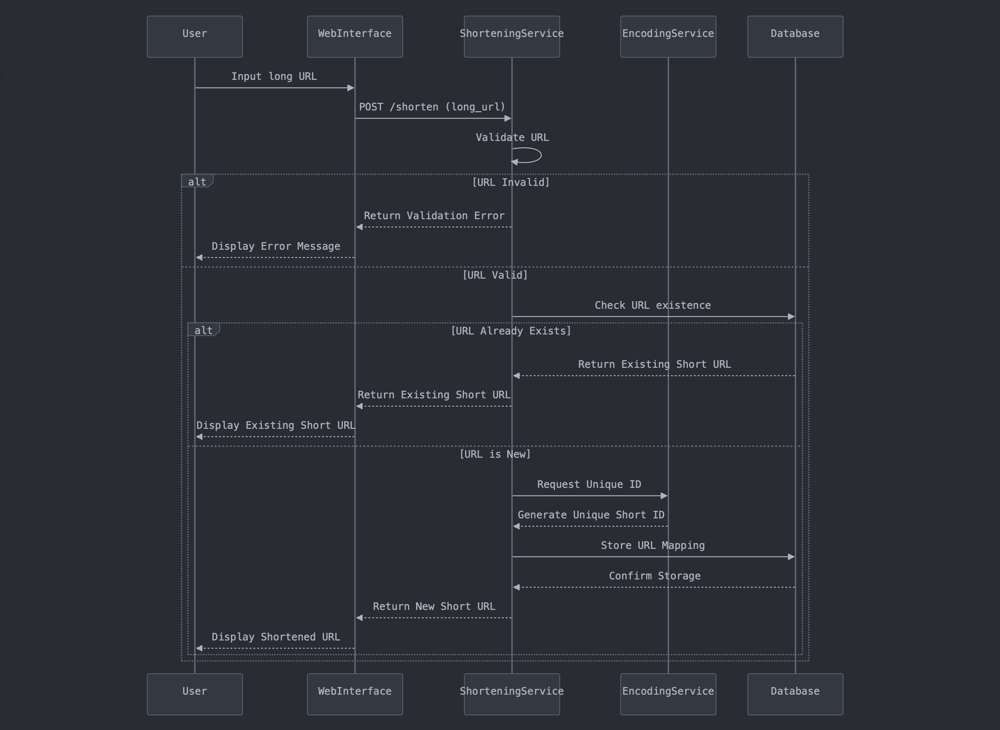

---
### Workflow for Shortening a Long URL

1. The `user` inputs a URL on the web interface. A **POST request** (e.g., `POST https://api.tinyurl.com/v1/shorten`), containing the input URL (e.g., `long_url: https://www.example.com/some/very/long/url`), is sent to the **`shortening service`**.

2. The **`shortening service`** validates the provided URL to ensure it follows a valid structure, is safe to use and is not already present in the database.

3. If the URL passes all checks, the `shortening service` calls the **`encoding service`** to encode the long URL into a unique ID (e.g., `abc123`) which can can be used to generate a unique short URL (e.g., `https://tinyURL/abc123`).

4. Once the short URL is generated, the **`shortening service`** stores the (`short_url → long_url`) mapping in the `database` and returns the shortened URL to the `user`.

---
### Workflow for Redirecting a URL

1. The **`user`** enters a short URL (e.g., `https://tinyURL/abc123`) in the browser. A **GET request** (e.g., `GET /abc123`) is sent to the **`redirection service`**.

2. The **`redirection service`** extracts the **short URL ID** (e.g., `abc123`) and use it to query the `database` to retrieve the corresponding long URL.

3. Once retrieved, the **`redirection service`** sends an **HTTP 301 (Permanent) or 302 (Temporary) redirect** response to the browser.

4. The browser automatically redirects the user to the **original long URL**.

---
