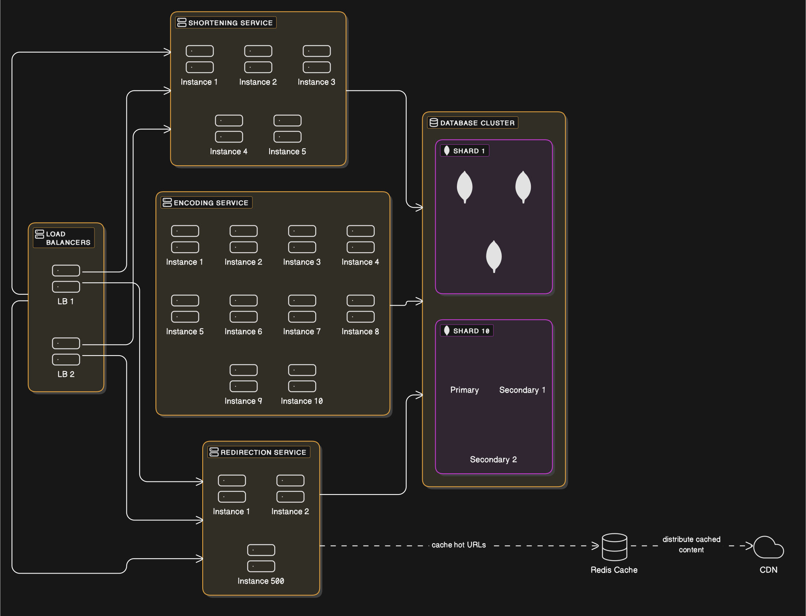

### Load Estimation for Shortening Service

Considering the **shortening service** is a **write-heavy service**, its load estimation must involve analysing the following **key load parameters**:

**1. Requests Per Second (RPS):**
- <strong>Assumption:</strong> Daily Average URL Generation Requests = 10 Million
- Requests Per Second = 10 Million / (24 hours × 3600 seconds ) ~ <strong>100 RPS</strong>

**2. Write Throughput Capacity:**
- <strong>Assumption:</strong> Average Processing Time = 10 milliseconds / request
- Throughput Capacity = 1 / 0.01 = <strong>100 RPS</strong>

<strong>Assumption:</strong> The peak traffic can be <strong>5 times the average</strong>. Hence, the system must be designed to handle <strong>500 RPS</strong> during peak hours.

Considering a single application server can handle <strong>100 RPS</strong>, we can deploy <strong>5 application servers</strong> behind a <strong>load balancer</strong> to efficiently handle all incoming URL shortening requests.

> NOTE: Since every URL shortening request involves generating a unique short ID, the **encoding service** must be handle the same load as the **shortening service**.

---
### Load Estimation for Redirection Service

Considering the **redirection service** is a **read-heavy service**, its load estimation must involve analysing the following **key load parameters**:

**1. Requests Per Second (RPS):**
- <strong>Assumption:</strong> Daily Average Redirection Requests = 10 Million x 100 = 1 Billion
- Requests Per Second = 1 Billion / (24 hours × 3600 seconds ) ~ <strong>10,000 RPS</strong>

**2. Read Throughput Capacity:**
- <strong>Assumption:</strong> Average Processing Time = 10 milliseconds / request
- Throughput Capacity = 1 / 0.01 = <strong>100 RPS</strong>

<strong>Assumption:</strong> The peak traffic can be <strong>5 times the average</strong>. Hence, the system must be designed to handle <strong>50,000 RPS</strong> during peak hours.

Considering a single application server can handle <strong>100 RPS</strong>, we can deploy <strong>500 application servers</strong> behind a <strong>load balancer</strong> to efficiently handle all URL redirection requests.

> NOTE: Since the system is a read-heavy system, i.e., there will be more reads than writes, we can store the (`short_url → long_url`) mapping in a **cache** (e.g., `Redis`) to improve performance.

---

### Storage Capacity Estimation

The system needs to persist the **user details** and their **shortened URL mappings**. 

Considering the **`url_mapping`** dataset will grow at a much faster rate than the **`user`** dataset, analysing its **storage requirement** is crucial for designing an efficient data model and choosing the right database.

**Storage Requirement:**
- <strong>Assumption:</strong> Daily Average URL Generation Requests = 10 Million
- <strong>Assumption:</strong> URLs Generated in 10 Years = 10 Million × 365 days × 10 years = 36.5 × 109 ≈ 40 Billion URLs
- <strong>Assumption:</strong> Total Storage per Mapping = 100 bytes (long URL) + 20 bytes (short ID) + 30 bytes (metadata) = 150 bytes
- Required Storage in 10 years = 40 Billion URLs × 150 bytes = 6 × 1012 = <strong>6 TB</strong>

To handle **`massive read traffic`** and **`high availability`** requirements, we may need to add **read replicas** and perform **data partitioning** on the **`url_mapping`** dataset.

**Data Replication Strategy:**
- **`Single-Leader Replication`** is ideal because it offers **high read throughput** by allowing reads from both the **leader** and **follower replicas**. All **writes** are routed through the **leader**, ensuring **data consistency**. Even if the leader fails, the system remains **highly available for reads**.

**Data Partitioning Strategy:** 
- **`Hash-Based Partitioning`** is ideal because the primary access pattern involves exact lookups using the `short_id`, and there’s no need for range queries. This strategy distributes data uniformly across partitions, preventing hot spots and ensuring balanced load.

<strong>MongoDB</strong> seems to be an ideal choice. Its <strong>leader-follower replication model</strong> aligns well with your <strong>Single-Leader Replication</strong> strategy, ensuring <strong>strong consistency for writes</strong> and <strong>high read throughput</strong> from followers. It also supports <strong>hash-based partitioning</strong>, making it capable of horizontally scaling to billions of records.

> **NOTE:** **Cassandra** follows an **eventual consistency** model by default, which might not be ideal for a shortening service that **requires strong consistency for mapping uniqueness**.

---
### System Architecture

Design the system following a **microservices architecture** to account for **scalability**, **fault tolerance**, and **high availability**. It should consist of the following major components:

1. **Load Balancer:** Deploy a minimum of **2 load balancers** to distribute incoming traffic across **`shortening service`** and **`redirection service`** to ensure even load distribution and minimise response time.

 2. **Shortening Service:** Deploy **5+ instances** to efficiently handle the peak load of **~500 RPS**.

2. **Encoding Service:** Deploy **10+ instances** with dedicated ID ranges (`40 Billion / 10 = 4 Billion IDs per instance`) to avoid collisions and central bottlenecks. No read replicas needed considering each instance generates its own IDs from allocated space. If an instance fails, its range can be re-assigned to another new instance.

3. **Redirection Service:** Deploy **500+ instances** to efficiently handle the peak load of **~50,000 RPS**. Can add **Redis** or **CDN caching** in front of database for hot URLs.

4. **Database Cluster:** Deploy **3 replicas per shard (1 primary for writes, 2 secondaries for reads and failover)**. For a setup with **10 shards**, this results in **30+ MongoDB nodes** (3 replicas × 10 shards), ensuring **high availability**, **fault tolerance**, and **horizontal scalability** for handling massive traffic and data volume.

> **NOTE:** Deploy centralised **monitoring tools** (e.g., Prometheus, Grafana) and **logging pipelines** (e.g., ELK stack) for observability, latency tracking, error reporting, and alerting. Use **circuit breakers**, **rate limiting**, and **retry logic** in services to maintain reliability under failure scenarios.

---

